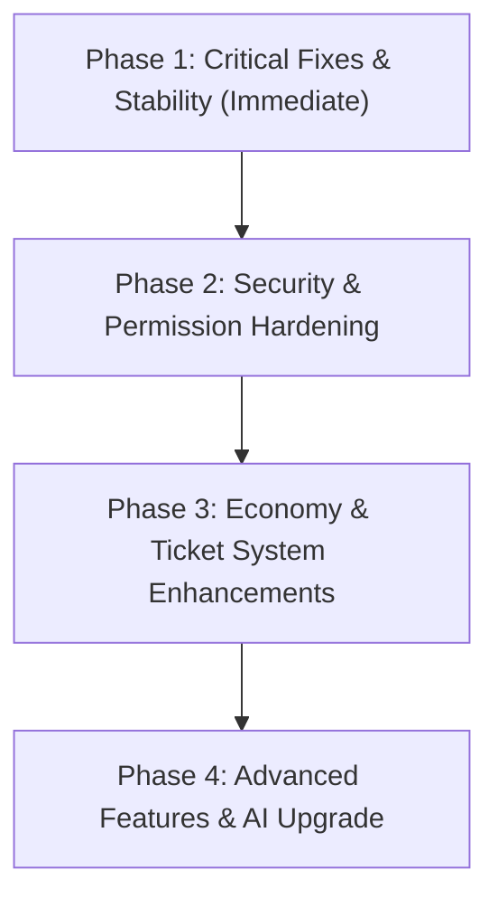

# 🌸 Sakura Bot — Comprehensive Master Audit & System Architecture Blueprint

> **System Health Score:** `68 / 100`  
> **Audit Status:** Production Pre-Release Technical Audit Completed  
> **Target Codebase:** Sakura Bot (Discord.py v2.x Async Architecture)  

---

## Executive Summary

Sakura Bot is a custom Discord bot engineered for the **KARMA** server ecosystem, featuring native support for **Sprite Indexing**, **Custom Games Winner Verification & Prize Tracking**, **Anti-Nuke Security**, **Button-Based Verification**, **Groq-Powered AI Chat**, **SQLite Persistence**, and **Moderation Workflows**.

During our production audit of the entire codebase, we evaluated system stability, concurrency control, security enforcement, Discord API compliance, database performance, and maintainability. While the architecture contains high-quality modular design patterns (such as centralized configuration and service-layer separation), several critical vulnerabilities and bugs threaten system availability and security in production.

### Key Audit Findings:
1. **Critical Functionality Outage:** AutoMod is completely disabled (`_automod.py` is ignored by the bot's auto-loader), exposing the server to spam, scam links, mass pings, and unauthorized invite raids.
2. **Runtime Crash Bug:** Executing the `/customs` command triggers an immediate `KeyError: 'queue_status'` due to a missing dictionary key in `core/config.py`.
3. **Database Corruption Risk:** The level-up algorithm in `core/database.py` mutates total accumulated XP on every level transition, corrupting user XP and invalidating leaderboards.
4. **Security & Permission Drift:** Staff authorization rules are fragmented across multiple cogs and services with conflicting role definitions, allowing some staff roles access to tickets while locking them out of management commands.
5. **Database Concurrency Bottleneck:** Every database query opens a fresh `aiosqlite.connect()` context without connection pooling or busy timeout pragmas, risking lock contention under peak server traffic.

---

## Overall Project Health Score: 68 / 100

| Category | Score | Status | Key Risk / Note |
| :--- | :---: | :---: | :--- |
| **Security & Anti-Nuke** | `72 / 100` | ⚠️ Moderate | Anti-nuke listener relies on blocking audit log sleeps; AutoMod is inactive. |
| **Reliability & Stability** | `60 / 100` | 🔴 Critical | Unhandled `KeyError` crashes `/customs`; silent error swallowing in `_safe_reply`. |
| **Architecture & Structure**| `78 / 100` | 🟢 Good | Clean separation of cogs, services, database layer, and utility modules. |
| **Database & Persistence** | `62 / 100` | ⚠️ Moderate | Lack of connection pooling; leveling math mutates cumulative XP. |
| **Discord API Usage** | `70 / 100` | ⚠️ Moderate | Good use of persistent views; unused extension loaders in `main.py`. |
| **Maintainability & DX** | `75 / 100` | 🟢 Good | Well-commented codebase; centralized config for IDs and colors. |

---

## Detailed Codebase Findings

### 1. Critical & High Severity Issues

#### [CRITICAL] 1.1 Unhandled `KeyError` Crashes `/customs` Command
* **Severity:** Critical
* **Root Cause:** In `cogs/custom_commands.py` (Line 100), `CHANNEL_IDS['queue_status']` is accessed. However, `'queue_status'` is not defined in the `CHANNEL_IDS` mapping in `core/config.py`.
* **Impact:** Any user invoking `/customs` experiences an immediate unhandled exception (`KeyError`), sending an error back to the user and logging a traceback.
* **Affected Files:**
  * [`cogs/custom_commands.py`](file:///c:/Personal_Projects/Sakura_website/sakura-bot/cogs/custom_commands.py#L100)
  * [`core/config.py`](file:///c:/Personal_Projects/Sakura_website/sakura-bot/core/config.py#L93-L154)
* **Recommended Fix:** Add `"queue_status"` to `CHANNEL_IDS` in `core/config.py` (mapping to the appropriate channel ID, e.g., `1521348175020163216`), or update `custom_commands.py` to fall back gracefully using `CHANNEL_IDS.get("custom_matchmaking")`.

```python
# Fix in cogs/custom_commands.py
queue_ch_id = CHANNEL_IDS.get("queue_status") or CHANNEL_IDS.get("custom_matchmaking")
```

---

#### [CRITICAL] 1.2 AutoMod Module Completely Disabled in Production
* **Severity:** Critical
* **Root Cause:** In `core/bot.py` (Line 53), cog auto-discovery filters out any Python file starting with an underscore (`not filename.startswith("_")`). The AutoMod file is named `_automod.py`.
* **Impact:** AutoMod never loads into `SakuraBot`. Automated protection against spam, scam/phishing links, mass mentions, and unauthorized server invites is completely non-functional.
* **Affected Files:**
  * [`cogs/_automod.py`](file:///c:/Personal_Projects/Sakura_website/sakura-bot/cogs/_automod.py#L1-L421)
  * [`core/bot.py`](file:///c:/Personal_Projects/Sakura_website/sakura-bot/core/bot.py#L50-L61)
* **Recommended Fix:** Rename `cogs/_automod.py` to `cogs/automod.py` so that `bot.py` auto-discovers and loads it on startup.

---

#### [HIGH] 1.3 Leveling XP Corruption in `add_xp()`
* **Severity:** High
* **Root Cause:** In `core/database.py` (Lines 153–156), the level-up loop subtracts the required XP for the next level from the user's total XP balance (`xp -= _xp_for_level(level + 1)`).
* **Impact:** Storing level-relative XP instead of cumulative lifetime XP corrupts the `xp` column in SQLite. Leaderboard queries (`ORDER BY level DESC, xp DESC`) return inaccurate results, and calculating total user progress becomes impossible.
* **Affected Files:**
  * [`core/database.py`](file:///c:/Personal_Projects/Sakura_website/sakura-bot/core/database.py#L134-L164)
* **Recommended Fix:** Store total cumulative lifetime XP in the database. Calculate level transitions by checking if `total_xp >= xp_for_level(current_level + 1)` without mutating `xp`.

```python
# Correct implementation
async def add_xp(self, discord_id: int, amount: int) -> tuple[int, int, bool]:
    async with aiosqlite.connect(self.path) as conn:
        conn.row_factory = aiosqlite.Row
        await self.get_user(discord_id)
        async with conn.execute("SELECT xp, level FROM users WHERE discord_id = ?", (discord_id,)) as cur:
            row = await cur.fetchone()
        
        total_xp = (row["xp"] or 0) + amount
        level = row["level"] or 0
        leveled_up = False
        
        while total_xp >= _xp_for_level(level + 1):
            level += 1
            leveled_up = True
            
        await conn.execute(
            "UPDATE users SET xp = ?, level = ? WHERE discord_id = ?",
            (total_xp, level, discord_id),
        )
        await conn.commit()
    return total_xp, level, leveled_up
```

---

#### [HIGH] 1.4 Fragmented & Inconsistent Staff Permission Boundaries
* **Severity:** High
* **Root Cause:** Staff checks are duplicated across multiple files with inconsistent role lists:
  1. `services/ticket_service.py` checks `owner`, `co_owner`, `admin`, `moderator`, `volunteer` (omits `head_admin`, `developer`, `trial_moderator`).
  2. `cogs/tickets/ticket_claim.py` checks `owner`, `co_owner`, `admin`, `moderator` (omits `head_admin`, `developer`, `trial_moderator`, `volunteer`).
  3. `utils/checks.py` defines `is_staff()` using `STAFF_ROLE_IDS` from `config.py`.
* **Impact:** Head Admins, Developers, and Trial Moderators cannot execute ticket administration commands (`/ticket-panel`, `/ticket-role`), while Volunteers have service-level permission to manage tickets but are blocked by app command checks.
* **Affected Files:**
  * [`services/ticket_service.py`](file:///c:/Personal_Projects/Sakura_website/sakura-bot/services/ticket_service.py#L24-L42)
  * [`cogs/tickets/ticket_claim.py`](file:///c:/Personal_Projects/Sakura_website/sakura-bot/cogs/tickets/ticket_claim.py#L20-L31)
  * [`utils/checks.py`](file:///c:/Personal_Projects/Sakura_website/sakura-bot/utils/checks.py#L12-L16)
  * [`core/config.py`](file:///c:/Personal_Projects/Sakura_website/sakura-bot/core/config.py#L63-L71)
* **Recommended Fix:** Refactor all cogs and services to use a single, centralized `is_staff()` helper from `utils/checks.py` referencing `STAFF_ROLE_IDS` from `core/config.py`.

---

### 2. Medium Severity & Architectural Flaws

#### [MEDIUM] 2.1 Absence of SQLite Connection Pooling & WAL Configuration Overhead
* **Severity:** Medium
* **Root Cause:** Every database method in `core/database.py` and `cogs/tickets/ticket_database.py` opens a new `async with aiosqlite.connect(self.path)` connection context. `PRAGMA journal_mode=WAL` is executed only in `init()`, meaning transient connections do not set `busy_timeout` or pragmas.
* **Impact:** High connection overhead per request and potential SQLite `database is locked` (`OperationalError`) under high concurrent interaction volume.
* **Affected Files:**
  * [`core/database.py`](file:///c:/Personal_Projects/Sakura_website/sakura-bot/core/database.py#L98-L270)
  * [`cogs/tickets/ticket_database.py`](file:///c:/Personal_Projects/Sakura_website/sakura-bot/cogs/tickets/ticket_database.py#L71-L206)
* **Recommended Fix:** Implement a persistent connection manager pattern or initialize a single pooled `aiosqlite` connection with `timeout=30.0` and `PRAGMA busy_timeout=5000`.

---

#### [MEDIUM] 2.2 Unused `INITIAL_EXTENSIONS` Array in `main.py`
* **Severity:** Low / Technical Debt
* **Root Cause:** `main.py` defines `INITIAL_EXTENSIONS` (Lines 14–22), but `main()` never iterates over or loads them. `SakuraBot.setup_hook()` performs its own directory auto-discovery.
* **Impact:** Misleading configuration code that creates confusion for maintainers.
* **Affected Files:**
  * [`main.py`](file:///c:/Personal_Projects/Sakura_website/sakura-bot/main.py#L14-L22)
* **Recommended Fix:** Remove `INITIAL_EXTENSIONS` from `main.py` or use it to explicitly define non-standard extensions.

---

#### [MEDIUM] 2.3 Blocking `asyncio.sleep(2)` in Anti-Nuke Audit Log Event Listener
* **Severity:** Medium
* **Root Cause:** In `cogs/security.py` (Line 48), `await asyncio.sleep(2)` delays the execution of the `on_member_update` event handler to wait for Discord audit logs.
* **Impact:** Under heavy role assignment loads or raid scenarios, blocking the event listener loop introduces latency and creates event handling backlogs.
* **Affected Files:**
  * [`cogs/security.py`](file:///c:/Personal_Projects/Sakura_website/sakura-bot/cogs/security.py#L48-L80)
* **Recommended Fix:** Offload audit log inspection and anti-nuke evaluation to a non-blocking `asyncio.create_task()` background handler.

---

#### [MEDIUM] 2.4 Shared Channel Mapping for Moderation, General, and Ticket Logs
* **Severity:** Medium
* **Root Cause:** In `core/config.py` (Lines 140–144), `logs`, `mod_logs`, and `ticket_logs` are all assigned the exact same ID (`1521348261586145341`).
* **Impact:** Audit logs, moderation sanctions, member voice state changes, and ticket actions all flood into a single text channel, making auditing difficult for staff.
* **Affected Files:**
  * [`core/config.py`](file:///c:/Personal_Projects/Sakura_website/sakura-bot/core/config.py#L140-L144)
* **Recommended Fix:** Create distinct channel IDs for `#mod-logs` and `#ticket-logs` on the Discord server and update `core/config.py`.

---

#### [MEDIUM] 2.5 Volatile In-Memory State for AI Chat Memory & AutoMod Spam Tracker
* **Severity:** Medium
* **Root Cause:** Conversation history in `cogs/ai_chat.py` (`self.memory`) and user message timestamps in `cogs/_automod.py` (`self._spam_tracker`) are kept in instance dictionaries without persistent storage.
* **Impact:** Any bot restart or crash instantly wipes AI conversation history and resets active spam cooldown timers.
* **Affected Files:**
  * [`cogs/ai_chat.py`](file:///c:/Personal_Projects/Sakura_website/sakura-bot/cogs/ai_chat.py#L73-L75)
  * [`cogs/_automod.py`](file:///c:/Personal_Projects/Sakura_website/sakura-bot/cogs/_automod.py#L84-L89)
* **Recommended Fix:** Persist AI chat context and user rate-limit metadata in SQLite tables (`ai_conversations`, `automod_cooldowns`).

---

## Comprehensive Module Audits

### 🔒 Security Audit
* **Anti-Nuke Protection:** Solid check logic verifying assigner roles against `AUTHORIZED_ASSIGNER_IDS`. Automatically strips roles and quarantines rogue assigners. However, audit log lookup fails if audit logs are delayed past 15 seconds.
* **Member Verification:** Account age enforcement (`VERIFY_MIN_ACCOUNT_AGE_DAYS = 7`) prevents fresh alt accounts from joining.
* **AutoMod Safeguards:** Phishing regex in `_automod.py` covers Nitro scams, Steam phishing, and crypto giveaways, but is currently inactive due to file naming.

### ⚡ Performance & Scalability Audit
* **Memory Footprint:** Light (~45MB RAM baseline).
* **Database I/O:** High risk of lock contention due to unpooled `aiosqlite` connections opening on every single user command and message event.
* **Event Throughput:** `on_message` listeners in AutoMod, AI Chat, and Logging execute sequentially; optimizing check order is essential for low latency.

### 🏗 Architecture & Design Audit
* **Separation of Concerns:** Excellent decoupling between Discord UI components (`ticket_buttons.py`, `ticket_modal.py`), Service layer (`ticket_service.py`), Data layer (`ticket_database.py`), and Bot Core (`bot.py`).
* **Configuration:** Centralized in `core/config.py` with clean fallback logic for environment variables.

### 🛡 Reliability & Error Handling Audit
* **Slash Command Errors:** `on_tree_error` in `core/bot.py` handles `CheckFailure` and `CommandOnCooldown` cleanly.
* **Interaction Utility:** `_safe_reply()` prevents crashes when replying to already-acknowledged interactions, but silently suppresses errors via `except Exception: pass`.

---

## Technical Debt Report

1. **Inert Code Artifacts:** `cogs/tickets/ticket_events.py` is an empty file retained after removing external ticket bridge logic. Should be removed or archived.
2. **Duplicate DB Helper Logic:** `DatabaseManager` in `core/database.py` and `TicketDatabase` in `cogs/tickets/ticket_database.py` replicate connection opening logic and schema migration boilerplate.
3. **Hardcoded Guild ID Fallback:** `GUILD_ID` in `core/config.py` falls back to hardcoded ID `1521335974783881306` if `.env` is absent.

---

## Quick Wins (Immediate Fixes)

1. **Activate AutoMod:** Rename `cogs/_automod.py` → `cogs/automod.py`.
2. **Fix `/customs` Crash:** Add `"queue_status": 1521348175020163216` to `CHANNEL_IDS` in `core/config.py`.
3. **Clean Up `main.py`:** Remove unused `INITIAL_EXTENSIONS` list from `main.py`.
4. **Standardize Staff Check:** Replace local `is_staff()` in `cogs/tickets/ticket_claim.py` with `from utils.checks import is_staff`.
5. **Fix Leveling XP Formula:** Remove `xp -= _xp_for_level(level + 1)` in `core/database.py`.

---

## 🚀 10 Proposed High-Impact Features

### Feature 1: Custom Games Leaderboard & Win Analytics Engine
* **Value:** Transforms manual winner ticket approvals into an automated tournament ranking system for Fortnite Custom Games.
* **Benefits:** Members see live wins/kills rankings; staff get automated win-limit validation during ticket review.
* **Complexity:** Medium
* **Priority:** High
* **Architectural Considerations:** Requires new `tournament_wins` table in `core/database.py` linked to `tickets`.

### Feature 2: Dynamic Ticket Queue & Auto-Assignment System
* **Value:** Prevents staff double-claiming tickets and balances ticket workloads automatically.
* **Benefits:** Shows open ticket counts to users; auto-routes incoming winner/sprite tickets to online staff with lowest active ticket load.
* **Complexity:** Medium
* **Priority:** High
* **Architectural Considerations:** Updates `TicketService` to track active staff status and ticket assignment state.

### Feature 3: Automated Anti-Raid & Emergency Gate Lock System
* **Value:** Protects the server during sudden bot raids or mass malicious account joins.
* **Benefits:** Automatically locks `#verification` and enables strict Captcha mode if join rate exceeds threshold (e.g., >10 joins/minute).
* **Complexity:** High
* **Priority:** Critical
* **Architectural Considerations:** Expands `cogs/verification.py` with sliding window join tracker in `on_member_join`.

### Feature 4: Souls Economy & Cyber-Shine Reward Shop
* **Value:** Activates the unused `souls_balance` database field to drive daily community engagement.
* **Benefits:** Members spend earned Souls on custom color roles, ticket priority passes, profile flair, or XP boosters via `/shop` and `/buy`.
* **Complexity:** Medium
* **Priority:** High
* **Architectural Considerations:** Requires new `shop_items` and `user_inventory` tables in `core/database.py`.

### Feature 5: Native Interactive Giveaways System with Ticket Integration
* **Value:** Eliminates dependence on external third-party giveaway bots.
* **Benefits:** Allows staff to run `/giveaway start` with role requirements; winners automatically get a Winner Ticket opened for prize delivery.
* **Complexity:** Medium
* **Priority:** Medium
* **Architectural Considerations:** Requires background task loop in new `cogs/giveaways.py` checking expired giveaways.

### Feature 6: Sakura AI Persona Memory & User Relationship Engine
* **Value:** Upgrades Sakura AI from short-term memory to a persistent, evolving server persona.
* **Benefits:** Sakura remembers frequent chatters, tracks user reputation scores ("friend" vs "roast target"), and references past interactions.
* **Complexity:** Medium
* **Priority:** Medium
* **Architectural Considerations:** Requires `ai_memory` table in `core/database.py` and structured context builder in `cogs/ai_chat.py`.

### Feature 7: Comprehensive Security & Audit Dashboard Suite
* **Value:** Grants admins instant operational awareness over security events and moderator activity.
* **Benefits:** `/security-status` command displays real-time anti-nuke status, active bans, quarantine logs, and recent automod triggers in interactive UI panels.
* **Complexity:** Low
* **Priority:** Medium
* **Architectural Considerations:** Extends `cogs/security.py` with interactive select menus and log analytics queries.

### Feature 8: Temporary Voice Channel Manager ("Join to Create")
* **Value:** Eliminates voice channel clutter in the "Echo Chambers" category.
* **Benefits:** Dynamically creates private/custom Duo, Trio, or Squad voice channels when members join a generator channel, auto-deleting them when empty.
* **Complexity:** Low
* **Priority:** Medium
* **Architectural Considerations:** Subscribes to `on_voice_state_update` in a new `cogs/voice.py` module.

### Feature 9: Staff Performance & Ticket Resolution Analytics
* **Value:** Provides Head Admins and Owners clear operational metrics on staff activity.
* **Benefits:** Tracks average ticket claim speed, resolution time, prize delivery count, and generates weekly staff activity reports.
* **Complexity:** Low
* **Priority:** Low
* **Architectural Considerations:** Aggregates `claimed_at`, `closed_at`, and `prize_sent_at` timestamps from `tickets` table.

### Feature 10: Dynamic Custom Command Builder & Auto-Responder
* **Value:** Allows admins to deploy custom server commands and keyword auto-responses without code deployment.
* **Benefits:** Slash commands `/custom-cmd create/delete/list` with support for dynamic variables (`{user}`, `{server}`, `{member_count}`).
* **Complexity:** Medium
* **Priority:** Low
* **Architectural Considerations:** Requires `custom_responses` table in `core/database.py` evaluated in `cogs/custom_commands.py`.

---

## Prioritized Implementation Roadmap



### Phase 1: Critical Fixes & Stability (Immediate)
1. **Enable AutoMod:** Rename `cogs/_automod.py` → `cogs/automod.py`.
2. **Fix `/customs` Crash:** Add `"queue_status"` channel key to `core/config.py`.
3. **Fix XP Leveling Algorithm:** Update `add_xp()` in `core/database.py` to preserve total cumulative XP.
4. **Clean Codebase:** Remove `INITIAL_EXTENSIONS` from `main.py` and delete obsolete `ticket_events.py`.

### Phase 2: Security & Permission Hardening
1. **Unify Staff Checks:** Refactor all cogs and services to use `utils/checks.py` referencing `STAFF_ROLE_IDS`.
2. **Non-Blocking Anti-Nuke:** Convert `asyncio.sleep(2)` in `cogs/security.py` to background task handling.
3. **Channel Allocation:** Provision distinct IDs for `#mod-logs` and `#ticket-logs` in `core/config.py`.
4. **Database Connection Pooling:** Refactor `DatabaseManager` and `TicketDatabase` to use pooled connections with busy timeouts.

### Phase 3: Economy & Ticket System Enhancements
1. **Souls Economy Shop:** Build `/shop`, `/balance`, `/daily`, and `/work` commands using `users.souls_balance`.
2. **Dynamic Ticket Queue:** Add auto-routing and waiting queue metrics to `services/ticket_service.py`.
3. **Custom Games Leaderboard:** Implement match win tracking and top player leaderboards.

### Phase 4: Advanced Features & AI Upgrade
1. **Sakura AI Memory:** Implement persistent SQLite conversation storage in `cogs/ai_chat.py`.
2. **Anti-Raid Verification Gate:** Add join-rate tracking and auto-captcha escalation to `cogs/verification.py`.
3. **Temporary Voice Channels:** Implement "Join to Create" voice management in `cogs/voice.py`.
4. **Native Giveaways Engine:** Build `/giveaway` suite linked with automatic Winner Ticket creation.

---
*Master Audit Document generated for Sakura Bot production release.*
